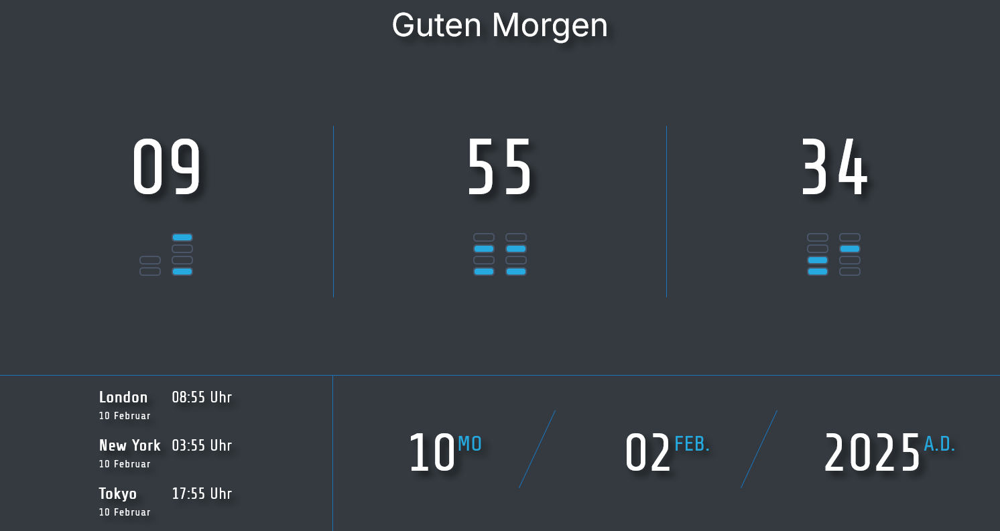

# Description
Small project to display the current time with the moment.js library. 

- Current time and Date
- Current time in binary format (4bit for each digit)
- Current time in different timezones
- Greeting message based on the time of the day

# Screenshots

# Libraries
### jQuery  
jQuery is a fast, small, and feature-rich JavaScript library. It makes things like HTML document traversal and manipulation, event handling, and animation much simpler with an easy-to-use API that works across a multitude of browsers.  

### Moment.js  
Moment.js is a JavaScript library for parsing, validating, manipulating, and formatting dates. It helps in managing dates and times in JavaScript in a more readable and maintainable way.
[momentjs.com](https://momentjs.com/)

# Dev
You can install the necessary tailwindcss dependencies using npm:

`npm install`

Alternatively, you can use npx to run the Tailwind CSS CLI watcher directly from the internet without installing it locally:

> npx @tailwindcss/cli -i ./css/src/tailwindcss.css -o ./css/libs/tailwind.css --watch

